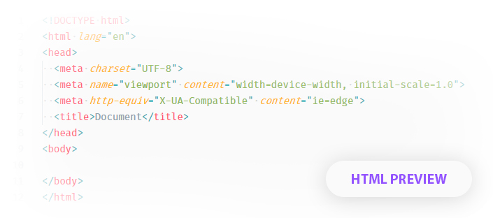
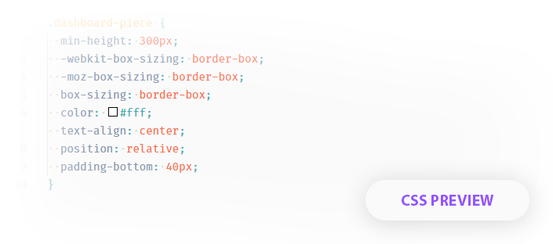
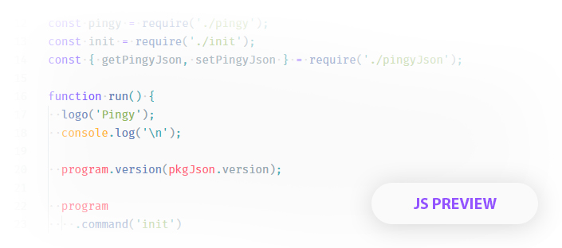

<p align="center"></p>

## Before use this settings, you need to install following requirements:

1. [Material Theme](https://marketplace.visualstudio.com/items?itemName=Equinusocio.vsc-material-theme)
2. [vscode-icons](https://marketplace.visualstudio.com/items?itemName=robertohuertasm.vscode-icons)
3. [Fira Code (Font)](https://github.com/tonsky/FiraCode)

## Theme preview:





## How to install:

1. Open command pallete in VS Code using shortcuts __Ctrl+Shift+P__
2. Then search for __Preferences: Open User Settings__ and hit enter
3. Copy this settings into __settings.json__
   ```json
   {
      "workbench.colorTheme": "Material Theme Lighter",
      "editor.lineHeight": 23,
      "editor.fontSize": 14,
      "editor.fontFamily": "Fira Code, 'Courier New', monospace",
      "editor.tabSize": 2,
      "editor.cursorStyle": "block",
      "editor.roundedSelection": false,
      "editor.multicursorModifier": "ctrl",
      "editor.cursorBlinking": "solid",
      "editor.renderWhitespace": "all",
      "editor.dragAndDrop": false,
      "terminal.integrated.shell.windows": "C:\\Program Files\\Git\\bin\\bash.exe",
      "workbench.iconTheme": "vscode-icons"
   }
   ```
4. Save and have fun!